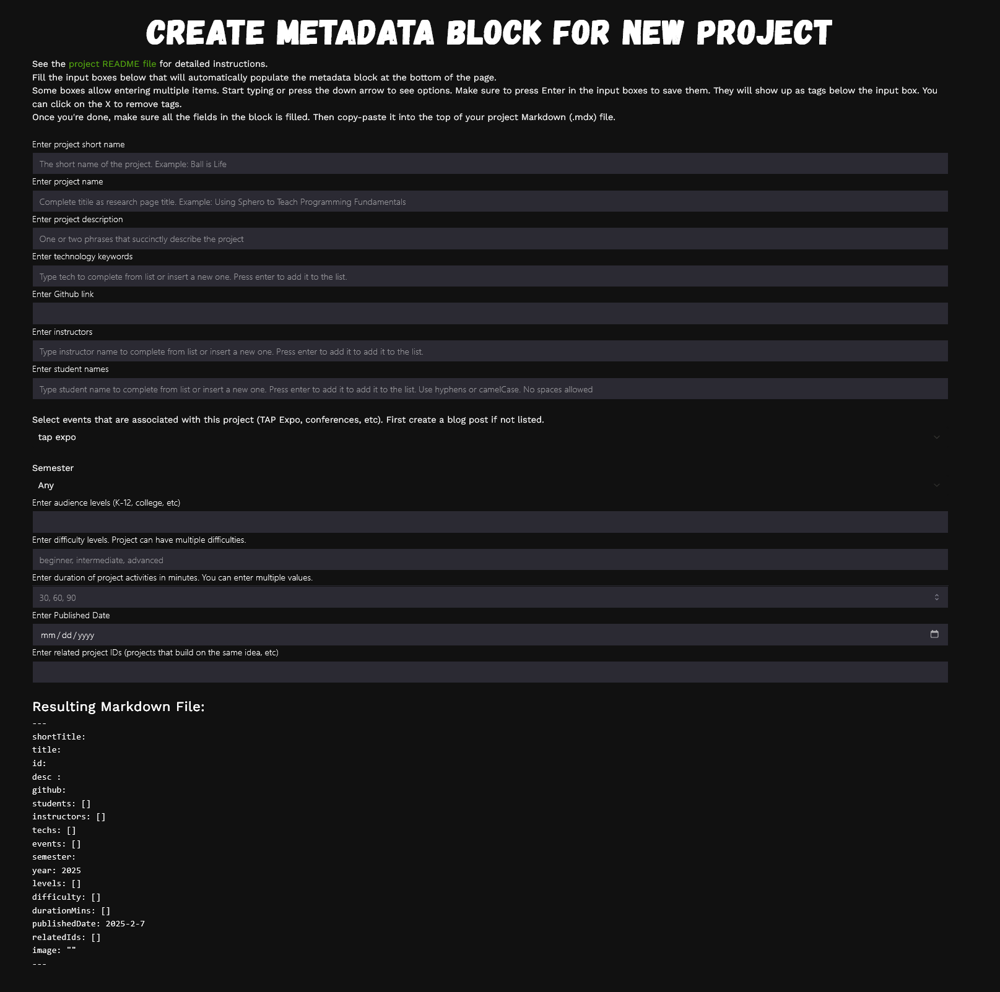
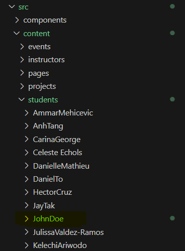
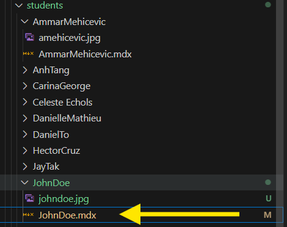
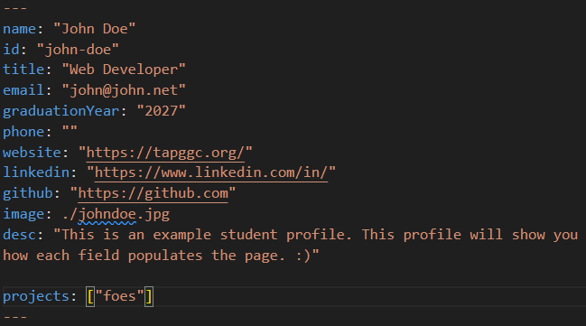
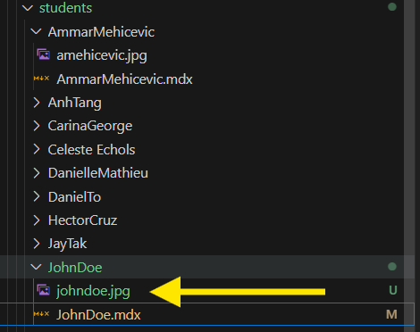

# TAP Projects and Blog Website with Astro, AgnosticUI, and Vue.js

Website for browsing TAP projects and blog posts. Built with static and dynamic components using the [Astro](https://astro.build/) framework. UI components from [AgnosticUI](https://agnosticui.com/) and dynamic [Vue 3](https://vuejs.org/) components.

Hosted at [tapggc.org](https://tapggc.org) using [Github Pages](https://pages.github.com), which is automatically deployed from this repository on each commit to `main` branch.

## How to Build and Deploy

All commands are run from the root of the project, from a terminal:

| Command           | Action                                       |
|:----------------  |:-------------------------------------------- |
| `npm install`     | Installs dependencies                        |
| `npm run dev`     | Starts local dev server at `localhost:3000`  |
| `npm run build`   | Build your production site to `./dist/`      |
| `npm run preview` | Preview your build locally, before deploying |

## How to Add a Blog Entry

Create a mdx file under `/src/content/posts/`, under the appropriate semester directory. Check metadata of other posts to set field appropriately. 

## 👀 How to Create a Project
1. Navigate to the 'Add Project' from the More Menu on the Tapggc.org page

2. Complete the form and copy the markdown template below inot the created mdx File.

3. Create a folder for desired project with respect to {year}-{month}{semester} (use camelCase)

4. Create a Markdown file within the folder (using camelCase)

5. [VERY IMPORTANT!] Every Project requires an image. Attach desired image within folder as well.

6. Add the Image Path to the Image portion

7. All Setup! Now add as much information as you need

## 👀 How to Create a Student Profile
Create a folder and a mdx file under `/src/content/students/` under the appropriate semester directory with the name convention StudentName. Check metadata of other projects to set fields appropriately.

1. Create a folder for desired project with respect to {year}-{month}{semester} (use CapitalCase)

2. Create a Markdown file within the folder (using CapitalCase). You can copy the JohnDoe.mdx file into the appropriate student folder. Correct the metadata to reflect the appropriate student.

3. Every Student Profile requires an **square** image. Attach desired image within folder as well. Make sure photos are cropped to the square proportions before adding it to the appropriate folder. the image file type does not matter

4. Add the Image Path to the Image portion

5. All Setup! Now add as much information as you need
