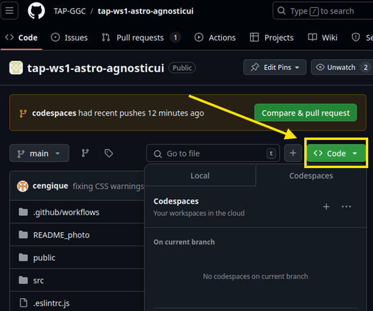
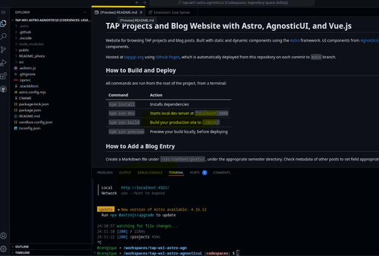
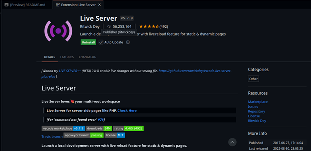
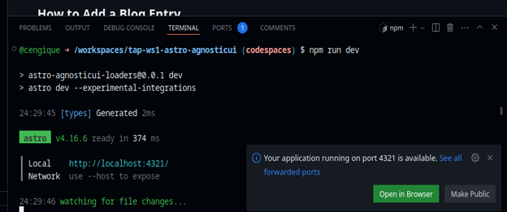
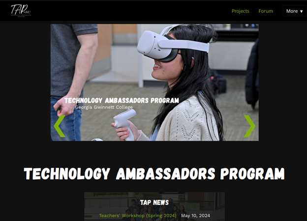
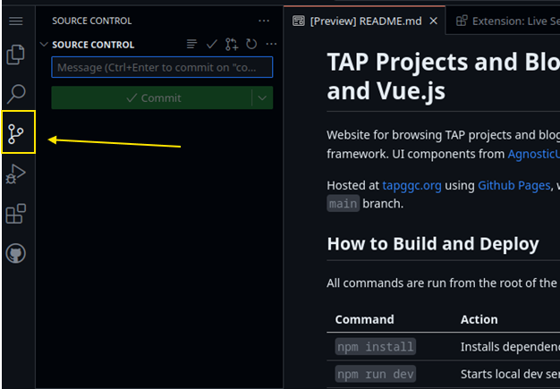
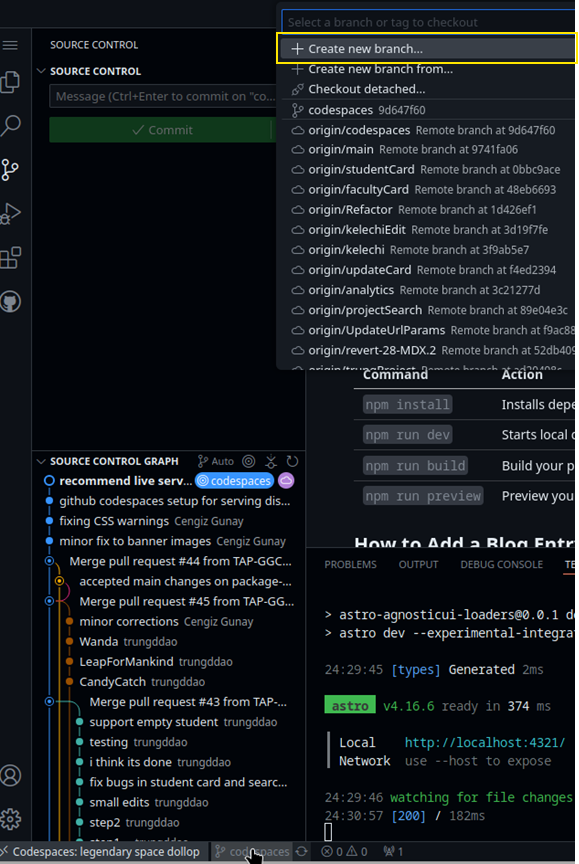

# Using Github Codespaces cloud IDE to modify the TAP Website

To preview your changes when making changes to the [TAP website](https://tapggc.org), you can use an online IDE using Github Codespaces without cloning the repository on your computer or installing anything. If you are working as a team, only one person needs to get this process started by creating a branch. Then, others can create their own Codespaces on the same branch to join to help editing.

## Find the code for the website
Start by opening the [Github repo page for the TAP website](https://github.com/TAP-GGC/tap-ws1-astro-agnosticui).

## 👀 Create a Github Codespace

To start a Github Codespace to see previews of your changes, do the following (alternatively you can clone and run npm locally as described in the project [README](https://github.com/TAP-GGC/tap-ws1-astro-agnosticui/blob/main/README.md)):

1. Click on the Code button, and select the Codespaces tab

    

1. Click on the “+” button to create a new codespace. This will open a browser tab with VS Code running in it. 

    

1. Make sure to install the “Live Server” plugin that will pop up as recommended. If you miss it, click on the Extensions button on the left sidebar and search and install it.

    

    When you install the Live Server extension, you should see that it will install NPM and then run steps to build the project. If this does not happen, you can type “npm i” for the first time you create your codespace. 

1. To see a preview of the current website, navigate to the terminal at the bottom and type `npm run dev`. This will process the files and start watching for changes. At the end, a pop up will ask you to view the site. Click on the “Open in Browser” button and the site preview will open on a new tab.

    

1. At this point, you are ready to develop your project page.

    

## Create a new branch to make your changes 👀 

1. Start by creating your own team branch. Click on the fork icon on the VS Code left sidebar 

    

    and then click on the “main” branch at the bottom-left of the screen. Once the menu pops, select “Create a new branch” and name your team branch. Then click on “Publish branch” to push your branch.

    

2. Now you are ready to make changes. If any of your teammates join, make sure they switch (not create) to the same branch. The steps to add a new project, blog entry, or student profile are outlined in the [README file of the repository](https://github.com/TAP-GGC/tap-ws1-astro-agnosticui/blob/main/README.md). 

## Submitting your changes for review

Once you are happy with the changes you made in your team branch and everything is committed and published to Github, you can create a [pull request](https://docs.github.com/en/pull-requests/collaborating-with-pull-requests/proposing-changes-to-your-work-with-pull-requests/creating-a-pull-request) so we can review and accept your changes. Start by navigating to the [pull requests section in our repo](https://github.com/TAP-GGC/tap-ws1-astro-agnosticui/pulls), click on the green **“New pull request”** button, and select your team branch on the **“compare:”** pulldown. If everything looks good, then press **“Create pull request”** to submit it.