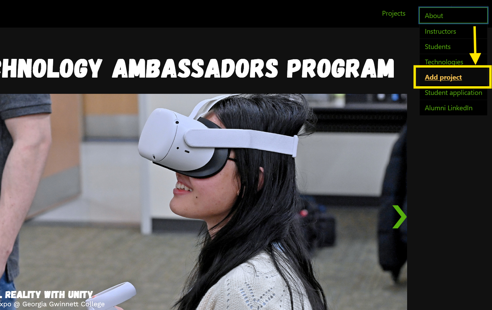
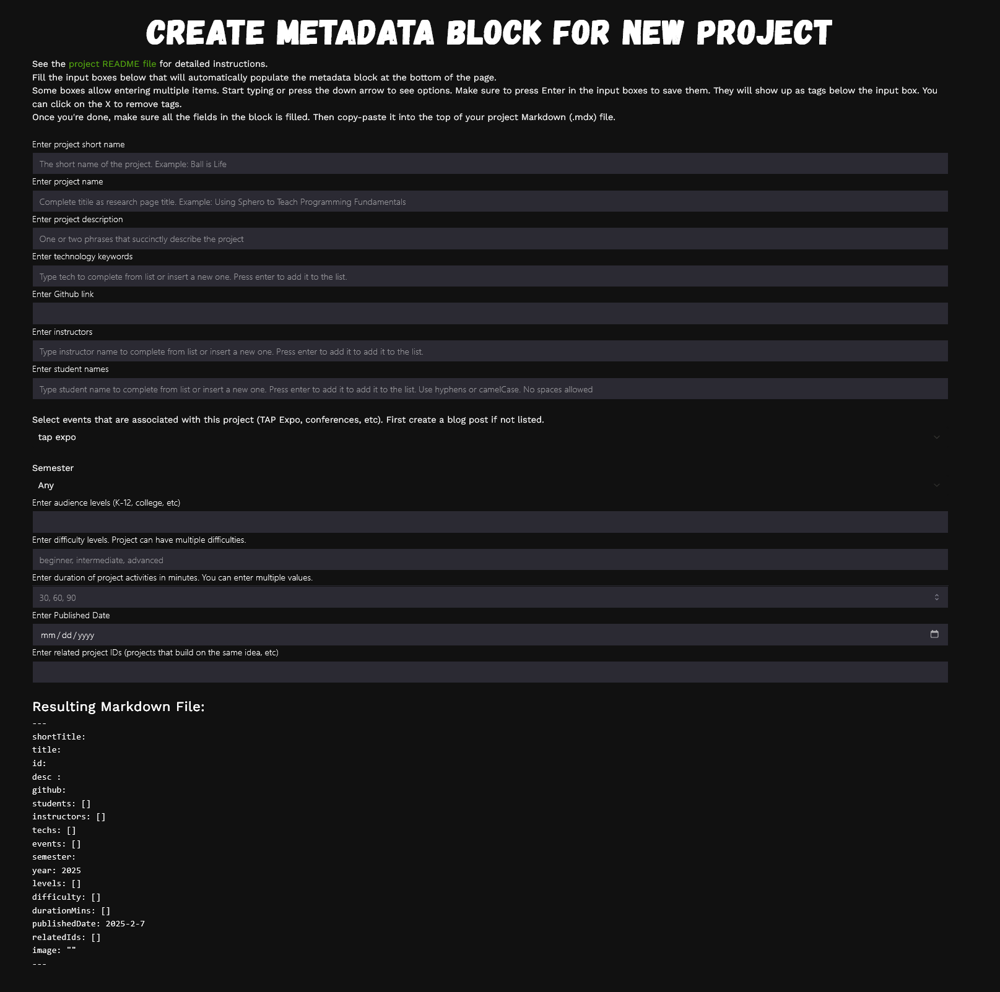

# Adding a TAP Project

First, make sure you selected an appropriate method to build and run the project either by [cloning](../../README.md) or using [Github codespaces](../github-codespace/README.md).

## Overall process

Adding a new project requires creating a folder and an MDX file under the appropriate semester directory. The MDX file requires a metadata block on top that whose fields need to be set appropriately and then the rest of the file can be filled with Markdown format as explained below. 

## 👀 Use the project template generator
You can access the [MD Template here](https://tapggc.org/template/)


Navigate to Create Projects Markdown


Complete the form and copy the markdown template below


## 👀 Create a project folder

Locate the semester folder under `/src/content/projects/` for desired project, and if it doesn't exist, create a new semester folder in the format `{year}-{month}{semester}` (e.g., 2023-08Fall)


## 👀 Create a Markdown file

Create a MDX Markdown file within the folder with the name convention ProjectName (e.g. JediSphero, BallIsLife). Make sure to use extension `.mdx`, ignore the image below.


## 👀 Fill in the metadata and upload image files

Copy-paste the template from the form above into your file. Make sure the website still builds, if not you may need to fix the errors. Note that there is a new `shortTitle` item that is also required. This is going to be the very short title of your project that will be used in listings (e.g. "Jedi Sphero").

Every Project requires an image. Attach a desired image that has a square aspect ration within folder as well


Add the image path to the new entries `imageLogoLight` or `imageLogoDark` for light-mode and dark-mode versions of your project logo, preferably with a transparent background. Finally, you also need a team photo uploaded and entered under `teamPhoto`.


## 👀 New! Video and image carousels

Other new requirements: the `videos` entry now takes the following format and displays as a video carousel at the bottom of your project page. The videos need to be hosted in the TAP YouTube account. Instructors will do that for you. Once they are in there, the `src` entry is the embed code you get from Youtube when you click on share. Until then, you could put the names of the files as `src` temporarily until we upload your videos.

```yaml
videos: [
 {src: "LAu1CeJtu_Q?si=AcRs9piXJeWouMp6", caption: "Installing Sphero Edu"} ,
 {src: "ej4uR7sUrAw?si=4JHqj1fgXhTiHwRg" , caption: "Creating a Teacher Sphero Account"} ,
 {src: "3PSOkOrgY9g?si=ylERtGFnYhsydKdh", caption: "Creating a Classroom and Adding Students in Sphero Edu"} ,
 {src: "SYQ1Sk9o07E?si=J7VJDk5-XsiZTfO_", caption: "Creating a Program in Sphero Edu"} 
]
```

Similarly, the `images` entry creates a carousel and has the following format:

```yaml
images: [
   { src: './TeamPhoto.png', alt: 'Team Photo'},
    { src: './DescribingSpherFunctions.png', alt: '/Describing Sphero Functions'},
    { src: './ShowingCodeToStudent.png', alt: 'Showing Code To Student'},
    { src: './ExplainingTheFreeThrowChallenge.png', alt: 'Explaining The Free ThrowChallenge'},
    { src: './Figure8Challenge.png', alt: 'Figure 8 Challenge'},
]
```

## After finishing

All Setup! Now add as much information as you need below the `---` sign in Markdown format. See the screenshot and examples below.


## Example project page
You can follow the examples of previous projects:
**Ball is Life**: [page](https://tapggc.org/projects/2019/fall/ball-is-life/), [source](https://github.com/TAP-GGC/tap-ws1-astro-agnosticui/blob/main/src/content/projects/2019-08Fall/BallIsLife/BallIsLife.mdx) - click on the “Code” button so see the actual MDX content

## Submitting your changes

Make sure to create a [pull request](https://docs.github.com/en/pull-requests/collaborating-with-pull-requests/proposing-changes-to-your-work-with-pull-requests/creating-a-pull-request) from your branch or fork to submit your changes. See more details in the [Github Codespaces page](../github-codespace/README.md).
